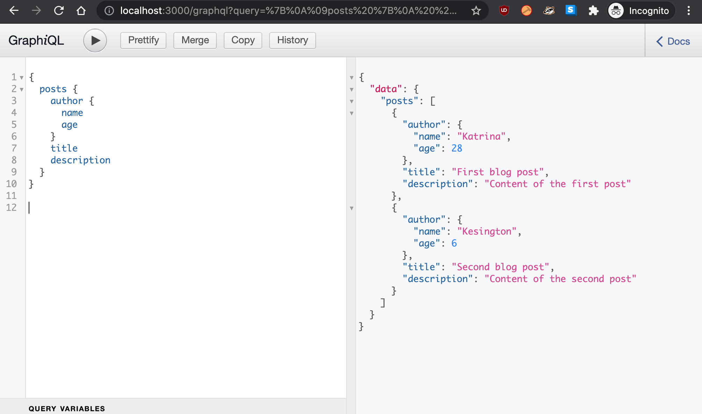

# GraphQL API with Node.js and Express

## Introduction

In this mini project, I created a GraphQL server using a bare bones setup.

## Process

I started the project by creating a new Node.js project and installed the npm packages express, graphql and express-graphql.

Next, I inititialized Express and express-graphql in the app.js file. 

Then I defined a schema in the schema.js file. 

Lastly, I integrated the schema into the express app by requiring the schema.js file. 

To test the API, I used GraphiQL. 

